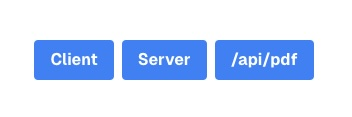

# react-pdf-with-next-pages-router

[Next.js Pages Router](https://nextjs.org/docs/pages/building-your-application) x [React-pdf](https://react-pdf.org/) を組み合わせて、PDFのレンダリングやPDFファイルの生成をやってみるリポジトリです。

# サーバー起動

```terminal
git clone git@github.com:YOS0602/react-pdf-with-next-pages-router.git
cd react-pdf-with-next-pages-router
npm i
npm run dev
```
→ ブラウザから http://localhost:3000/ にアクセスします。

# 動作確認

Topページにアクセスすると、以下の3つのボタンが表示されています。

- Client
- Server
- /api/pdf



## Client

クライアントサイドでPDFを描画する。

## Server

サーバーサイドでPDFを描画し、フロントからは `object` ([MDN](https://developer.mozilla.org/ja/docs/Learn/HTML/Multimedia_and_embedding/Other_embedding_technologies)) でファイルにアクセスする。

## /api/pdf

サーバーサイドでPDFを描画し、HTTPレスポンスとしてPDFを返す。
